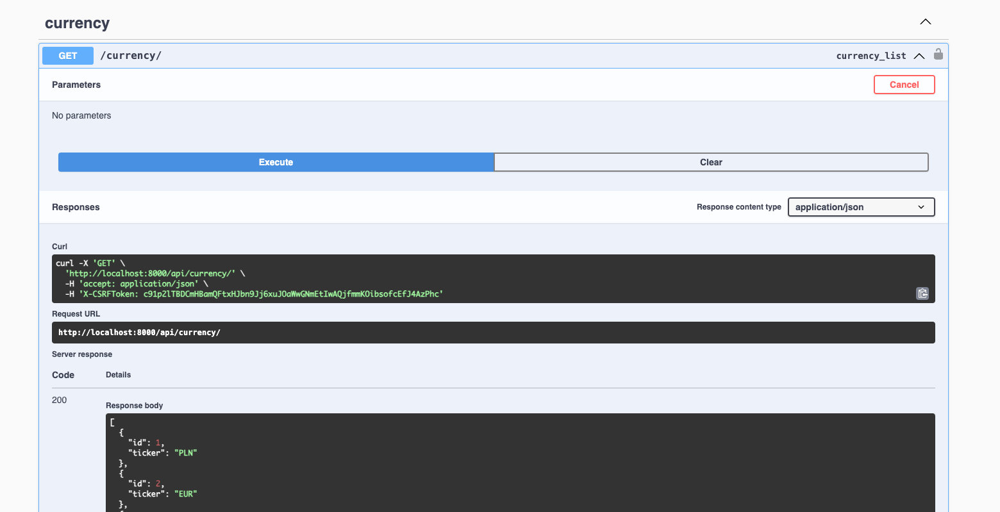
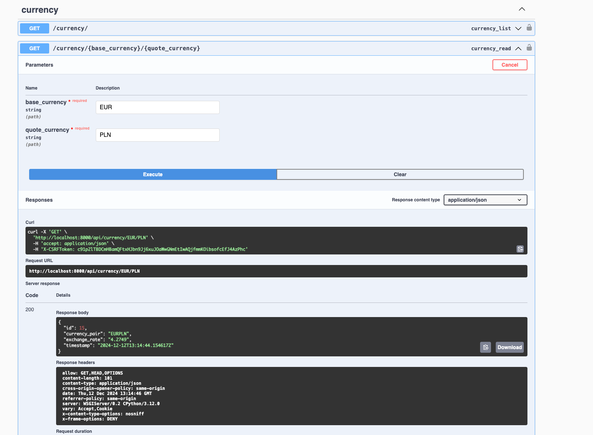

# Django Exchange API

## `Installation`
1. Clone repository `[...]` 

    (or with HTTPS `git clone [...]`)

Create venv and install dev dependencies:

1. `python -m venv venv`
2. `source ./venv/bin/activate`
3. `pip install -r requirements.txt`
4. `pip install --upgrade setuptools`

## `Run application`
1. `python backend/manage.py makemigrations`
2. `python backend/manage.py migrate`
3. `python backend/manage.py runserver`

## `Reset script`
Use `./reset.sh` to create new database, apply migrations and load default data

don't forget to use chmod +x reset.sh :)

## `Management commands`

- Create currencies declared in settings:

`python backend/manage.py create_currencies`

- Create currency pairs:

`python backend/manage.py create_currency_pairs`

- Load data from yahoo finance to create ExchangeRates:

`python backend/manage.py load_yahoo_finance_data`

## `Swagger`

Test API with swagger: http://localhost:8000/swagger

Example:

- GET `api/currency`

#
- GET `api/currency/EUR/PLN`

#
## `Tests`

To run tests:

`python backend/manage.py test currencies.tests`